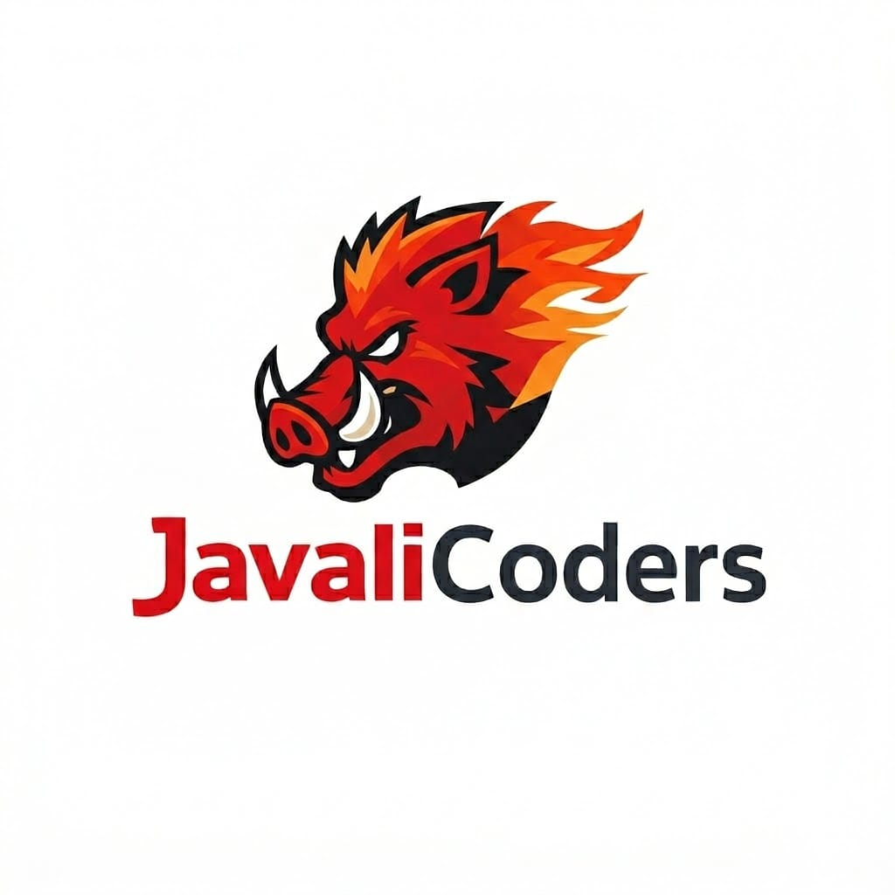

<div align="center">
  
  <h2>JavaliCoders</h2>

  | [Desafio](#desafio) | [Solução](#solucao) | [Backlog do Produto](#backlog) | [DoR e DoD](#dor-dod) | [Evolução do Projeto](#evolucao) | [Cronograma de Sprints](#sprint) | [Tecnologias](#tecnologias) | [Estrutura do Projeto](#estrutura) | [Como Executar](#execucao) | [Documentação](#documentacao) | [Equipe](#equipe) |
</div>

Status do Projeto: 🚧 Em andamento

---

## 🏅 Desafio <a name="desafio"></a>

O desafio consiste em desenvolver uma plataforma integrada de Gestão de Compras para uma organização. O objetivo é criar uma ferramenta digital que otimize o processo de compras, desde a solicitação até o recebimento, onde os usuários possam criar pedidos, solicitar cotações comparativas, registrar recebimentos com conferência de produtos e analisar dados de compras. A plataforma visa aprimorar a eficiência operacional, reduzir custos através de análise comparativa de fornecedores e garantir rastreabilidade completa de todas as operações de compra.

---

## 🏅 Solução <a name="solucao"></a>

A plataforma desenvolvida pela equipe JavaliCoders centraliza todo o ciclo de compras em um único sistema web. Funcionários podem abrir pedidos de compra e acompanhar cada etapa do processo em tempo real. O setor financeiro gerencia cotações com múltiplos fornecedores, podendo anexar documentos e notas fiscais diretamente no sistema. Cada ação — aprovação, rejeição, alteração de status, registro de recebimento — é registrada no histórico do pedido, garantindo rastreabilidade completa do processo. Gestores e diretores têm acesso a um dashboard com indicadores de desempenho, permitindo análise comparativa de fornecedores, acompanhamento de prazos e visibilidade sobre o estoque, facilitando a tomada de decisão com base em dados.

---

## 📊 Backlog do Produto <a name="backlog"></a>

### SPRINT 1 - Fundação Operacional

| Rank | Prioridade | User Story                                                                                                                          | Story Points | Sprint | Status |
|------| --- |-------------------------------------------------------------------------------------------------------------------------------------| --- | --- | --- |
| 1    | Alta | Como diretor, quero cadastrar novos usuários no sistema, para permitir que eles acessem a plataforma conforme seu perfil de acesso. | 3 | 1 | ✅ |
| 2    | Alta | Como funcionário, quero fazer login no sistema, para acessar as funcionalidades conforme meu perfil.                                | 5 | 1 | ✅ |
| 3    | Alta | Como financeiro, quero cadastrar produtos, para utilizá-los em pedidos e cotações.                                                  | 3 | 1 | ✅ |
| 4    | Alta | Como usuário, quero visualizar o estoque, para acompanhar a disponibilidade de produtos.                                            | 3 | 1 | ✅ |
| 5    | Alta | Como financeiro, quero cadastrar fornecedores, para realizar cotações e analisar opções mais viáveis.                               | 3 | 1 | ✅ |
| 6    | Alta | Como financeiro, quero visualizar os fornecedores, para analisar suas informações e escolher fornecedor viável para as cotações.    | 3 | 1 | ✅ |
| 7    | Alta | Como funcionário, quero criar um pedido de compra, para solicitar materiais ou produtos necessários para o setor.                   | 5 | 1 | ✅ |
| 8    | Alta | Como funcionário, quero visualizar pedidos feitos, para consultar informações, histórico e alterações de status.                    | 1 | 1 | ✅ |

---

### SPRINT 2 - Ciclo Completo de Logística

| Rank | Prioridade | User Story | Story Points | Sprint | Status |
|------|------------|------------|--------------|--------|--------|
| 9   | Alta       | Como diretor/administrador, quero aprovar pedidos de compra, para autorizar cotação.                                                                | 3            | 2 | ✅ |
| 10  | Alta       | Como diretor/administrador, quero negar pedidos, para bloquear compras desnecessárias.                                                              | 1            | 2 | ✅ |
| 11  | Média      | Como financeiro/diretoria, quero cancelar pedidos que não foram aprovados, para indicar que não serão realizados.                                   | 1            | 2 | ✅ |
| 12  | Alta       | Como financeiro, quero registrar uma cotação realizada, para um pedido de compra, para solicitar aprovação da diretoria antes de realizar a compra. | 3            | 2 | ✅ |
| 13  | Alta       | Como diretor ou financeiro, quero visualizar as cotações de um pedido,para analisar fornecedores e tomar decisão de aprovação ou compra.            | 2            | 2 | ✅ |
| 14  | Alta       | Como diretor, quero aprovar ou rejeitar uma cotação, para autorizar ou negar a compra.                                                              | 2            | 2 | ✅ |
| 15  | Média      | Como financeiro, quero registrar que a compra de um pedido foi realizada, para atualizar o status do pedido e iniciar o acompanhamento da entrega.  | 3            | 2 | ✅ |
| 16  | Média      | Como funcionário, quero filtrar os pedidos, para encontrar mais facilmente o pedido desejado.                                                       | 2            | 2 | ✅ |
| 17  | Alta       | Como operacional, quero registrar a nota fiscal, para iniciar o processo de recebimento.                                                            | 2            | 2 | ✅ |
| 18  | Alta       | Como operador de conferência, quero conferir os produtos recebidos, para validar a entrega.                                                         | 5            | 2 | ✅ |
| 19  | Alta       | Como operador de estoque, quero registrar a saída do material, para atender ao pedido.                                                              | 5            | 2 | ✅ |

---

### SPRINT 3 - Inteligência e Valor Agregado

| Rank | Prioridade | User Story | Story Points | Sprint | Status |
|------|------------|------------|--------------|--------|--------|
| 20   | Média | Como funcionário, quero filtrar os produtos do estoque de acordo com a quantidade, para facilitar a visualização de produtos que precisam ser comprados. | 2            | 3 | ⏳ |
| 21   | Média | Como diretor/financeiro, quero poder acessar pedidos, cotações e compras pesquisando por um produto, para facilitar o acesso ao histórico de compra de um produto. | 3            | 3 | ⏳ |
| 22   | Média | Como operador de estoque, quero registrar manualmente a entrada de material no estoque, para corrigir ou ajustar o saldo quando houver reposição ou erro de contagem. | 2            | 3 | ⏳ |
| 23   | Média | Como operador de estoque, quero registrar manualmente a saída de um produto do estoque, para manter o controle correto do saldo de estoque. | 2            | 3 | ⏳ |
| 24   | Alta | Como funcionário, quero visualizar o histórico de movimentações do estoque, para acompanhar entradas, saídas e ajustes realizados. | 5            | 3 | ✅ |
| 25   | Alta | Como diretor/administrador, quero visualizar um dashboard visual com indicadores, para acompanhar o desempenho das compras e do funcionamento dos processos. | 8            | 3 | ⏳ |

---

## 📝 DoR e DoD <a name="dor-dod"></a>

### DoR - Definition of Ready

- User Stories escritas no formato "Como [persona], quero [ação] para que [objetivo]"
- As US contêm critérios de aceitação definidos
- Subtarefas divididas a partir das US
- Priorização atribuída (Alta, Média, Baixa)
- Story Points estimados

### DoD - Definition of Done

- Funcionalidade implementada e testada
- Código revisado via Pull Request
- Documentação atualizada
- Vídeo demonstrativo do incremento entregue

> <!-- TODO: Ajustar o DoR e DoD conforme os critérios definidos pela equipe e pelo professor -->

---

## 📈 Evolução do Projeto <a name="evolucao"></a>

#### 🏁 Sprint 1 - Fundação Operacional

- **Status**: ✅ Concluída
- **Período**: 16/03 a 05/04
- **Objetivo Principal**: Estruturar autenticação, cadastros base (usuários, produtos, fornecedores) e criação de pedidos
- **Principais Entregas**:
  - ⏳ Cadastro e login de usuários
  - ⏳ Cadastro de produtos e fornecedores
  - ⏳ Visualização de estoque
  - ⏳ Criação e listagem de pedidos de compra
- **Documentação Detalhada**: <!-- TODO: [Sprint 1 Docs](link) -->

---

#### 🎯 Sprint 2 - Ciclo Completo de Logística

- **Status**: ✅ Concluída
- **Período**: 13/04 a 03/05
- **Objetivo Principal**: Implementar fluxo completo de aprovação, cotação, recebimento e entrega
- **Principais Entregas**:
  - ⏳ Aprovação/negação de pedidos
  - ⏳ Registro de cotações com aprovação da diretoria
  - ⏳ Conferência de recebimento e registro de divergências
  - ⏳ Finalização do pedido
- **Documentação Detalhada**: <!-- TODO: [Sprint 2 Docs](link) -->

---

#### 🎯 Sprint 3 - Inteligência e Valor Agregado

- **Status**: ⏳ Não iniciada
- **Período**: 11/05 a 31/05
- **Objetivo Principal**: Adicionar filtros avançados, movimentações manuais de estoque e dashboard gerencial
- **Principais Entregas**:
  - ⏳ Filtros de estoque e fornecedores
  - ⏳ Movimentações manuais (entrada/saída)
  - ⏳ Histórico de movimentações
  - ⏳ Dashboard com indicadores
  - ⏳ Gerenciamento de usuários pelo diretor
- **Documentação Detalhada**: <!-- TODO: [Sprint 3 Docs](link) -->

---

## 📅 Cronograma de Sprints <a name="sprint"></a>

| Sprint | Período | Documentação                                          | Vídeo do Incremento |
| --- | --- |-------------------------------------------------------| --- |
| 🔖 **SPRINT 1** | 16/03 a 05/04 | [Sprint 1 Docs](src/docs/processo/sprints/sprint1.md) | [Incremento 1](https://youtu.be/emA2FphtdvA?si=2VLTmvQdCKcekJwb)|
| 🔖 **SPRINT 2** | 13/04 a 03/05 | [Sprint 2 Docs](src/docs/processo/sprints/sprint2.md) | <!-- TODO: [Incremento 2](link YouTube) --> |
| 🔖 **SPRINT 3** | 11/05 a 31/05 | [Sprint 3 Docs](src/docs/processo/sprints/sprint3.md) | <!-- TODO: [Incremento 3](link YouTube) --> |

---

## 💻 Tecnologias <a name="tecnologias"></a>


---

## 📁 Estrutura do Projeto <a name="estrutura"></a>

<!-- TODO: Atualizar o diagrama abaixo com a estrutura real do projeto Java/Spring Boot após o desenvolvimento -->

```
├── 📁 src
│   ├── 📁 docs
│   │   ├── 📁 cliente
│   │   │   ├── 📄 manual_de_instalacao.pdf
│   │   │   └── 📄 user_manual.md
│   │   └── 📁 processo
│   │       ├── 📁 sprints
│   │       ├── 📄 dor_e_dod.md
│   │       ├── 📄 estrategia_de_branch.md
│   │       ├── 📄 modelo_logico_banco.png
│   │       ├── 📄 modelo_logico_bd.mwb
│   │       └── 📄 padrao_de_commit.md
│   │
│   ├── 📁 main
│       ├── 📁 java
│       │   └── 📁 api
│       │       ├── 📁 connection
│       │       ├── 📁 controller
│       │       ├── 📁 DAO
│       │       ├── 📁 model
│       │       ├── 📁 util
│       │       ├── ☕ Main.java
│       │       └── ☕ MainApp.java
│       │
│       └── 📁 resources
│           ├── 📁 db
│           ├── 📁 images
│           ├── 📁 style
│           └── 📁 view
│
├── ⚙️ .gitignore
├── 📄 pom.xml
└── 📄 README.md
```

---

## ⚡ Como Executar <a name="execucao"></a>

## Pré-Requisitos

Certifique-se de ter instalado:

- [Java JDK 21+](https://www.oracle.com/java/technologies/downloads/)
- [IntelliJ IDEA](https://www.jetbrains.com/idea/download/)
- [MySQL Server 8.0+](https://dev.mysql.com/downloads/mysql/)
- [Git](https://git-scm.com/downloads)

---

## 1. Clonar o Repositório

```bash
git clone https://github.com/JavaliCoders/API-2026-1.git
cd API-2026-1
```

---

## 2. Configurar o Banco de Dados

1. Inicie o MySQL Server.
2. Crie o banco de dados:

```sql
CREATE DATABASE bd_api;
```

3. Execute o script de criação das tabelas:

```bash
src/main/resources/db/bd_api.sql
```

---

## 3. Abrir no IntelliJ IDEA

1. Abra o IntelliJ e clique em **File > Open**, selecionando a pasta do projeto.
2. Aguarde o carregamento das dependências (Maven/Gradle).
3. Confirme que o JDK está¡ configurado em **File > Project Structure > Project**.

---

## 4. Executar o Projeto

### Opção 1: Pelo IntelliJ (recomendado para desenvolvimento)

1. Certifique-se de que o MySQL Server está rodando.
2. Localize a classe principal (`Main`) em `src/main/java`.
3. Clique com o botão direito em **Run 'Main'** ou pressione `Shift + F10`.

### Opção 2: Gerando o .jar

1. Vá em **File > Project Structure > Artifacts**.
2. Clique em **+ > JAR > From modules with dependencies**.
3. Selecione a classe principal no campo **Main Class** e clique em **OK**.
4. Vá em **Build > Build Artifacts > Build**.
5. O `.jar` será gerado em `out/artifacts/`.
6. Execute com:

```bash
java -jar API-2026-1.jar
```

> Caso ocorra erro de módulos com JavaFX, use:
> ```bash
> java --module-path /caminho/para/javafx/lib --add-modules javafx.controls,javafx.fxml -jar API-2026-1.jar
> ```

---

## Dicas

- Sempre verifique se o MySQL Server está ativo antes de rodar o projeto.
- Para atualizar o repositório: `git pull origin main`
- Após alterar o `pom.xml`, recarregue o Maven com botão direito no arquivo no **Maven > Reload Project**Como Executar o Projeto


## 📄 Documentação <a name="documentacao"></a>

<!-- TODO: Atualizar os links conforme os arquivos forem criados -->

> Pasta de documentação: [docs](src/docs)
>
> Checklist de DoR e DoD: [Checklist](docs/processo/dor_e_dod.md) 
>
> DoR e DoD por Sprint: [DoR e DoD](docs/processo/sprints)
>
> Estratégia de Branch: [Branch](docs/processo/estrategia_de_branch.md) 
>
> Padrão de Commits: [Commits](docs/processo/padrao_de_commit.md)
>
> Manual de instalação: [Manual de Instalação](src/docs/cliente/manual_de_instalacao.pdf)
> 
> Manual do usuário: [Manual do Usuário](src/docs/cliente/user_manual.md)
---

## 🎓 Equipe <a name="equipe"></a>

<div align="center">
  <table>
    <tr>
      <th>Membro</th>
      <th>Função</th>
      <th>GitHub</th>
      <th>LinkedIn</th>
    </tr>
    <tr>
      <td>Kamille Fernandes</td>
      <td>Product Owner</td>
      <td><a href="https://github.com/KamilleFernandes"></a></td>
      <td><a href="https://www.linkedin.com/in/kamille-f-da-silva-122a10284/"></a></td>
    </tr>
    <tr>
      <td>Nicolas Pacheco</td>
      <td>Scrum Master</td>
      <td><a href="https://github.com/Nocholas0"></a></td>
      <td><a href="https://www.linkedin.com/in/nicolas-pacheco-591216287/"></a></td>
    </tr>
    <tr>
      <td>Daniel Nathan</td>
      <td>Developer</td>
      <td><a href="https://github.com/Danithan"></a></td>
      <td><a href="https://www.linkedin.com/in/daniel-nathan-621b623aa/"></a></td>
    </tr>
    <tr>
      <td>Alex Gabriel</td>
      <td>Developer</td>
      <td><a href="https://github.com/AlexGabrielll"></a></td>
      <td><a href="https://www.linkedin.com/in/alex-gabriel-leonel-0b3339302/"></a></td>
    </tr>
    <tr>
      <td>Vinícius Henrique</td>
      <td>Developer</td>
      <td><a href="https://github.com/ViniciusAmante"></a></td>
      <td><a href="https://www.linkedin.com/in/vinicius-oliveira-amante/"></a></td>
    </tr>
    <tr>
      <td>Caio Moreira</td>
      <td>Developer</td>
      <td><a href="https://github.com/CaioMoreiraujo"></a></td>
      <td><a href="https://www.linkedin.com/in/caiomoreiradearaujo/"></a></td>
    </tr>
    <tr>
      <td>Mateus Borges</td>
      <td>Developer</td>
      <td><a href="https://github.com/MGBorgess"></a></td>
      <td><a href="https://www.linkedin.com/in/matheus-de-oliveira-b68bbb383/"></a></td>
    </tr>
  </table>
</div>
